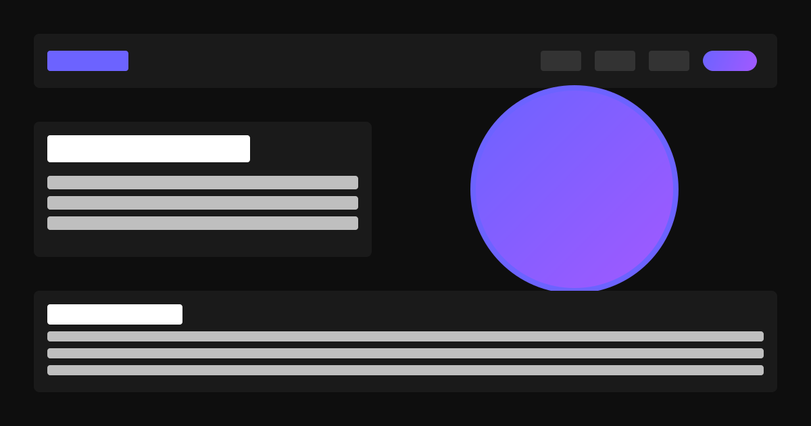

# 🌆 Cyberpunk Developer Portfolio

A blazing-fast, cyberpunk-themed developer portfolio built with **Next.js 15**, **TypeScript**, **Tailwind CSS v4**, **Framer Motion**, and **shadcn/ui**. Features neon aesthetics, glitch effects, smooth GPU-accelerated animations, and optimized for static deployment on Vercel.



## ✨ Features

- **🎨 90s-Futurist Cyberpunk Aesthetic**: Neon magenta, electric cyan, deep black with glitch effects
- **⚡ Super-Fast Load**: Static generation with Turbopack, code-splitting, and lazy-loaded components
- **🎭 Smooth Animations**: GPU-accelerated transitions with Framer Motion
- **📱 Retina-Sharp & Responsive**: Optimized for all screen sizes and high-DPI displays
- **🌈 Neon UI Components**: Glowing navigation, holographic cards, glassmorphic contact form
- **🔥 Performance Optimized**: Preloaded fonts, compressed images, tree-shaken dependencies
- **🌙 Dark-Only Theme**: Enforced dark mode with custom neon color palette

## 🛠️ Tech Stack

- **Framework**: Next.js 15 (App Router, TypeScript)
- **Styling**: Tailwind CSS v4 + shadcn/ui components
- **Animation**: Framer Motion for scroll-triggered and hover effects
- **Fonts**: Next.js Font Optimization (Montserrat, Open Sans)
- **Build Tool**: Turbopack for ultra-fast dev and builds
- **Hosting**: Vercel (static export)

## 🎨 Cyberpunk Color Palette

- **Neon Magenta**: `#FF00FF` - Primary accent, glitch effects
- **Electric Cyan**: `#00FFFF` - Secondary accent, neon glows
- **Void Black**: `#000000` - Background
- **White**: `#FFFFFF` - Primary text
- **Gray**: `#a3a3a3` - Secondary text

## 🚀 Getting Started

### Prerequisites

- **Node.js** v18+ (recommended v20+)
- **npm** or **yarn** or **pnpm**

### Installation

1. **Clone the repository**
   ```bash
   git clone https://github.com/yourusername/portfolio-site.git
   cd portfolio-site
   ```

2. **Install dependencies**
   ```bash
   npm install
   # or
   yarn install
   # or
   pnpm install
   ```

3. **Run the development server with Turbopack**
   ```bash
   npm run dev
   # or
   yarn dev
   ```
   This runs `next dev --turbopack` for ultra-fast hot reloading.

4. **Open your browser**
   Navigate to [http://localhost:3000](http://localhost:3000) to see your portfolio.

### Build for Production

```bash
npm run build
# or
yarn build
```

This generates a static export in the `out/` directory, ready for deployment.

## 🎨 Customization

### 1. Personal Information

Edit `src/app/page.tsx` to update:
- **Hero section**: Your name, title, and intro text
- **About section**: Bio and skills
- **Contact section**: Form action or email integration

### 2. Projects

Update `public/data/projects.json` with your own projects:
```json
[
  {
    "title": "Your Project",
    "description": "Brief description",
    "imageSrc": "/images/project-screenshot.png",
    "tags": ["Frontend", "API"],
    "liveUrl": "https://yourproject.com",
    "githubUrl": "https://github.com/you/project"
  }
]
```

Then update `src/components/ProjectsGrid.tsx` to load from the JSON file instead of hardcoded data.

### 3. Profile Picture

Replace `public/placeholder-profile.svg` with your own image (e.g., `public/profile.jpg`), then update the `<PortraitImage />` component in `src/components/PortraitImage.tsx`.

### 4. Colors & Theme

Edit `tailwind.config.js` and `src/app/globals.css` to customize:
- Neon colors (`--neon-magenta`, `--electric-cyan`)
- Gradient effects
- Glitch animation intensity

### 5. Fonts

Change fonts in `src/app/layout.tsx` by importing different Google Fonts via `next/font/google`.

## 🚀 Deployment

### Deploy to Vercel (Recommended)

1. **Push your code to GitHub**
2. **Import your repo on Vercel**: [vercel.com/new](https://vercel.com/new)
3. **Configure build settings** (auto-detected):
   - **Framework Preset**: Next.js
   - **Build Command**: `npm run build` (uses Turbopack)
   - **Output Directory**: `out` (static export)
4. **Deploy**: Vercel will build and deploy your site in seconds.

[](https://vercel.com/new/clone?repository-url=https://github.com/yourusername/portfolio-site)

### Alternative: Deploy to Netlify, Cloudflare Pages, or GitHub Pages

Since this project uses `output: 'export'` in `next.config.js`, you can deploy the static `out/` folder to any static hosting provider.

```bash
npm run build
# Upload the `out/` directory to your hosting provider
```

## 📦 Performance Optimizations

- ✅ **Static Export**: No server required, ultra-fast CDN delivery
- ✅ **Turbopack**: 10x faster builds and hot reloads
- ✅ **Lazy Loading**: `ProjectsGrid` is dynamically imported
- ✅ **Font Optimization**: Preloaded with `next/font`
- ✅ **Code Splitting**: Automatic per-route splitting
- ✅ **Tree Shaking**: Unused code eliminated via `optimizePackageImports`
- ✅ **Image Optimization**: Use Next.js `<Image>` component for auto-optimization

## 📄 License

This project is open-source and available under the **MIT License**. See the LICENSE file for details.

---

**Built with 💜 using Next.js 15, Tailwind CSS v4, and Framer Motion**
